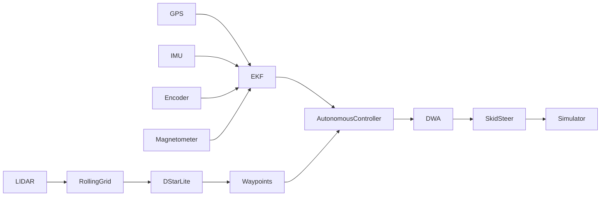

# 🚀 Modular Autonomous UGV Navigation Stack (PyBullet)

## Overview

This project implements a **modular autonomous navigation stack** for a differential-drive Unmanned Ground Vehicle (UGV) using **PyBullet** simulation.

The system includes:

- Multi-rate **Extended Kalman Filter (EKF)** localization
- **Dynamic Window Approach (DWA)** local planner
- Global path planning (A* via D* Lite interface)
- Rolling occupancy grid with obstacle inflation
- Waypoint tracking and autonomous control loop
- Threaded architecture for real-time simulation

The goal was to build a navigation stack **from first principles**, without relying on ROS navigation packages.

---

## 🧠 System Architecture



---

## 📦 Core Components

### 1️⃣ State Estimation — EKF

5-state nonlinear Extended Kalman Filter:

```
[x, y, yaw, v, yaw_rate]
```

Sensors fused:
- IMU (yaw_rate prediction)
- Encoders (linear & angular velocity)
- Magnetometer (absolute yaw correction)
- GPS (position correction)

Features:
- Multi-rate fusion (50Hz predict, 10Hz GPS update)
- Jacobian-based covariance propagation
- Joseph-form covariance update (numerical stability)
- Angle wrapping for yaw consistency
- Thread-safe design

---

### 2️⃣ Global Planner — A* (D* Lite Interface)

- Rolling occupancy grid (20m × 20m window)
- 8-connected grid search
- Path thinning to reduce DWA workload
- UNKNOWN cells treated as traversable
- Automatic snapping of start/goal if inside obstacles

Designed to support incremental replanning behavior.

---

### 3️⃣ Local Planner — Dynamic Window Approach (DWA)

Acceleration-constrained sampling of `(v, ω)` pairs.

Scoring function:
- Heading alignment to goal
- Obstacle clearance
- Forward velocity reward

Features:
- Dynamic velocity window based on robot constraints
- Constant velocity trajectory rollout
- Collision checking with inflated obstacles
- Waypoint tolerance handling
- Goal detection

---

### 4️⃣ Rolling Occupancy Grid

- Robot-centered rolling window
- LiDAR-based obstacle updates
- Vectorized free-space marking using NumPy
- Obstacle inflation for footprint safety
- Thread-safe access

---

### 5️⃣ Autonomous Controller

Runs at 20Hz:

1. Reads EKF state
2. Gets global path
3. Selects next waypoint
4. Converts LiDAR local frame → world frame
5. Runs DWA
6. Outputs velocity command

Supports:
- TELEOP mode
- AUTONOMOUS mode
- Goal detection and mode switching

---

## 🛠 Tech Stack

- Python 3.10+
- NumPy
- PyBullet
- Threading (multi-rate architecture)
- YAML configuration

---

## ▶ How to Run

```bash
pip install -r requirements.txt
python run.py
```

---

## 📊 Key Design Decisions

- Used 5-state EKF to explicitly model velocity dynamics.
- Applied acceleration-constrained DWA to reflect realistic differential drive limits.
- Implemented rolling grid instead of static global map for efficiency.
- Designed modular architecture mirroring production robotics stacks.

---

## 🚧 Future Improvements

- True incremental D* Lite implementation (rhs / g value updates)
- Adaptive covariance tuning for EKF
- KD-tree optimization for DWA clearance scoring
- Hardware deployment on Jetson platform

---

## 🎯 Motivation

This project was built to:

- Understand autonomy stack internals beyond ROS abstractions
- Design estimation + planning + control layers from scratch
- Explore real-time threaded robotics architecture
- Build a deployable foundation for physical UGV systems

---

## 📄 License

MIT License